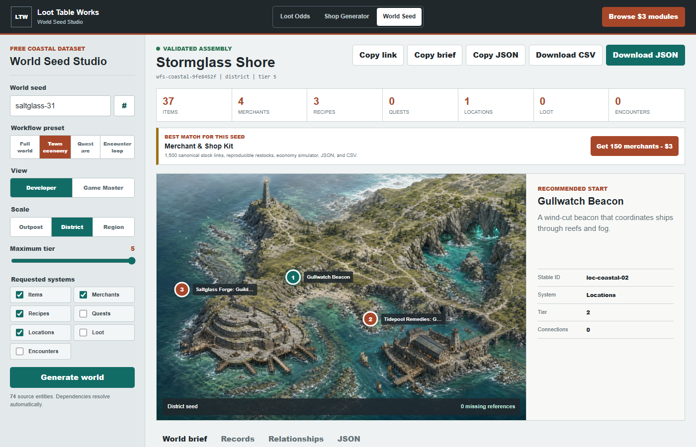

# Loot Table Works Game Data Tools

Free, local-first browser tools and original system-neutral fantasy data for game developers and tabletop creators.

[Open the World Foundry hub](https://loottableworks.github.io/loot-drop-calculator/world-foundry/)

## Free Browser Tools

| Tool | Use it for |
|---|---|
| [Loot Drop Probability Calculator](https://loottableworks.github.io/loot-drop-calculator/) | Calculate independent drop odds, expected rewards, and attempts needed for a target confidence. |
| [Fantasy Shop Inventory Generator](https://loottableworks.github.io/loot-drop-calculator/shop-inventory-generator/) | Generate deterministic shop stock, prices, shareable configurations, JSON, and CSV. |
| [World Seed Studio](https://loottableworks.github.io/loot-drop-calculator/world-seed-studio/) | Assemble dependency-closed regions, economies, quest arcs, and encounter loops. |
| [RPG Game Data Doctor](https://loottableworks.github.io/loot-drop-calculator/rpg-data-doctor/) | Audit JSON and CSV for duplicate IDs, missing references, broken weights, economy loops, quest gaps, and encounter transitions. |
| [RPG Data Bridge](https://loottableworks.github.io/loot-drop-calculator/rpg-data-bridge/) | Convert inspected JSON or CSV schemas into Unity C#, Godot 4 GDScript, and TypeScript starter models. |

All tools run in the browser without an account. Imported data stays in the active tab and is not uploaded, analyzed remotely, or written to persistent browser storage.

## Original `$3` Data Modules

The paid modules contain structured production data, offline workflow tools, documented schemas, free demos, and engine integration starters. Each module is sold independently for `$3` on [itch.io](https://loot-table-works.itch.io/).

| Module | Production boundary |
|---|---|
| [Item Catalog & Economy Kit](https://loot-table-works.itch.io/original-fantasy-item-data-pack) | 500 stable item records |
| [Merchant & Shop Kit](https://loot-table-works.itch.io/fantasy-merchant-shop-generator-kit) | 150 merchants and 1,500 stock relationships |
| [Crafting & Recipe Kit](https://loot-table-works.itch.io/fantasy-crafting-alchemy-recipe-kit) | 300 recipes and 900 ingredient relationships |
| [Enemy Loot & Reward Kit](https://loot-table-works.itch.io/enemy-loot-table-drop-profile-kit) | 250 profiles and 2,000 reward records |
| [Quest, Contract & Reward Kit](https://loot-table-works.itch.io/fantasy-quest-contract-reward-data-kit) | 240 quests arranged into 40 connected arcs |
| [Encounter & Threat Kit](https://loot-table-works.itch.io/fantasy-encounter-room-data-kit) | 180 encounters and 540 phases |

## Data Principles

- Stable IDs are durable integration keys; names are presentation labels.
- References must resolve across the selected data boundary.
- Random generation is deterministic when a seed is supplied.
- JSON and CSV exports remain inspectable without proprietary software.
- Free demos disclose their exact record boundaries.
- Generated content is reviewed with automated integrity, reference, packaging, runtime, and visual checks.

## Content Disclosure

Loot Table Works products contain original AI-assisted structured data, text, code, and marketing artwork. They do not include copyrighted characters, branded settings, protected game text, or rules-specific content from another publisher.

This repository hosts the public static tools. Individual product archives and their commercial-use terms are distributed through their verified itch.io pages.
